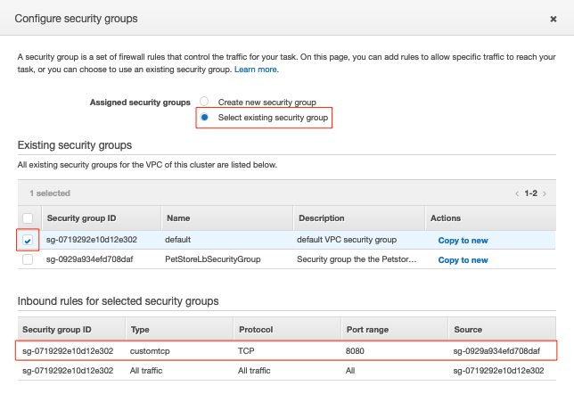
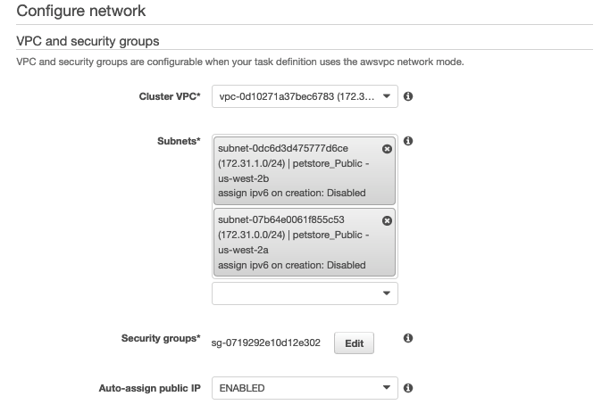
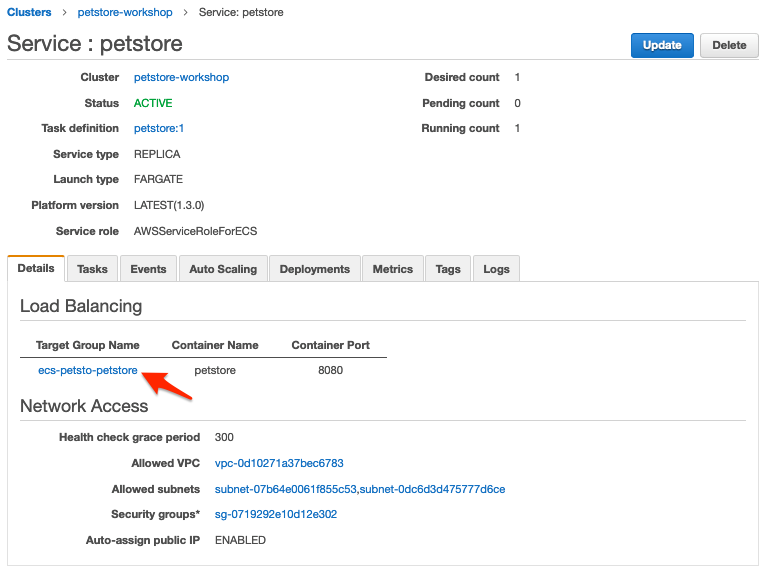
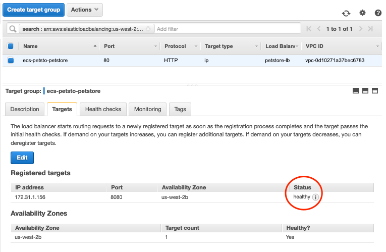

Container Orchestration
=======================

**Expected Outcome:**

-   200 level usage of Amazon ECS and Fargate.

**Lab Requirements:** Cloud9 IDE

**Average Lab Time:** 30-45 minutes

Introduction
------------

In this module, we’re going to deploy out Petstore applications using
[Amazon Elastic Container Service (Amazon
ECS)](http://aws.amazon.com/ecs/) to orchestrate our containers on top
of [AWS Fargate](http://aws.amazon.com/fargate/).

### Getting Started with Amazon ECS using AWS Fargate

Before we get started, here are some definitions you need to understand
in order to deploy your application when creating your first Amazon ECS
cluster.

<table>
<colgroup>
<col style="width: 50%" />
<col style="width: 50%" />
</colgroup>
<thead>
<tr class="header">
<th>Object</th>
<th>Cluster</th>
</tr>
</thead>
<tbody>
<tr class="odd">
<td>
<strong>Cluster</strong>
</td>
<td>
Logical grouping of tasks and services. Infrastructure may be shared between tasks and services running on the same cluster.
</td>
</tr>
<tr class="even">
<td>
<strong>Task Definition</strong>
</td>
<td>
Blueprint for our application. Defines attributes such as CPU and memory requirements, networking configuration, and container definitions.
</td>
</tr>
<tr class="odd">
<td>
<strong>Container Definition</strong>
</td>
<td>
Configuration for a container to run as part of our task. Defines attributes of the container including port mappings, resources requirements, environment variables, etc.
</td>
</tr>
<tr class="even">
<td>
<strong>Service</strong>
</td>
<td>
Maintains a specified number of running simultaneous instances of a task definition in an ECS cluster.
</td>
</tr>
</tbody>
</table>

You’ll deploy a service via Amazon ECS using AWS Fargate as the launch
type. The Fargate launch type allows you to run your containerized
applications without the need to provision and manage the back-end
infrastructure. Amazon ECS can also launch tasks and services using the
EC2 launch type which runs containerized applications on Amazon EC2
instances that **you** manage. Amazon ECS is the orchestration service
responsible for running docker containers and AWS Fargate is the
underlying compute platform where the containers will run.

#### Deploy our VPC

We will first deploy our CloudFormation template which configures our
ECS VPC.

Step 1  
Change to this modules directory by running:

    cd ~/environment/aws-modernization-workshop/modules/container-orchestration-ecs

Step 2  
Deploy the CloudFormation template to create your new VPC.

    aws cloudformation create-stack --stack-name "${USER_NAME}-petstore" \
    --template-body file://petstore-fargate-cf-resources.yaml \
    --capabilities CAPABILITY_NAMED_IAM

Example Output:

    {
        "StackId": "arn:aws:cloudformation:us-west-2:<REDACTED>:stack/<User Name>-petstore/5ce363e0-773c-11e9-9589-02c3ece5f9fa"
    }

Step 3  
Wait for the Template to finish deploying by running the following
command:

    until [[ `aws cloudformation describe-stacks --stack-name "${USER_NAME}-petstore" \
    --query "Stacks[0].[StackStatus]" --output text` == "CREATE_COMPLETE" ]]; \
    do  echo "The stack is NOT in a state of CREATE_COMPLETE at `date`";  \
    sleep 30; done && echo "The Stack is built at `date` - Please proceed"

#### Amazon ECS Task definitions

[Amazon ECS Task
definitions](https://docs.aws.amazon.com/AmazonECS/latest/developerguide/task_definitions.html)
are required to run Docker containers in Amazon ECS. For our Pestore
application, we will review the key pieces of a task definition before
we deploy it.

Step 1  
In the left-hand navigation pane, navigate to the
`continer-orchestration-ecs` folder and open the
`petstore-fargate-task-definition.json` file.

The file has the following content:

    {
      "family": "<UserName>",
      "networkMode": "awsvpc",
      "containerDefinitions": [{
          "name": "postgres",
          "image": "<YourAccountID>.dkr.ecr.us-west-2.amazonaws.com/<UserName>-petstore_postgres:latest",
          "cpu": 512,
          "memoryReservation": 1024,
          "environment": [{
              "name": "POSTGRES_DB",
              "value": "petstore"
            },
            {
              "name": "POSTGRES_USER",
              "value": "admin"
            },
            {
              "name": "POSTGRES_PASSWORD",
              "value": "password"
            }
          ],
          "portMappings": [{
            "containerPort": 5432
          }],
          "logConfiguration": {
            "logDriver": "awslogs",
            "options": {
              "awslogs-group": "/ecs/<UserName>",
              "awslogs-region": "us-west-2",
              "awslogs-stream-prefix": "postgress"
            }
          }
        },
        {
          "name": "petstore",
          "image": "<YourAccountID>.dkr.ecr.us-west-2.amazonaws.com/<UserName>-petstore_frontend:latest",
          "cpu": 512,
          "memoryReservation": 1024,
          "environment": [
            {
              "name": "DB_HOST",
              "value": "127.0.0.1"
            },
            {
              "name": "DB_NAME",
              "value": "petstore"
            },
            {
              "name": "DB_PASS",
              "value": "password"
            },
            {
              "name": "DB_PORT",
              "value": "5432"
            },
            {
              "name": "DB_URL",
              "value": "jdbc:postgresql://127.0.0.1:5432/petstore?ApplicationName=applicationPetstore"
            },
            {
              "name": "DB_USER",
              "value": "admin"
            }
          ],
          "portMappings": [{
            "containerPort": 8080
          }],
          "logConfiguration": {
            "logDriver": "awslogs",
            "options": {
              "awslogs-group": "/ecs/<UserName>",
              "awslogs-region": "us-west-2",
              "awslogs-stream-prefix": "frontend"
            }
          }
        }
      ],
      "executionRoleArn": "arn:aws:iam::<YourAccountID>:role/<UserName>-petstore-ExecutionRole",
      "requiresCompatibilities": [
        "FARGATE"
      ],
      "cpu": "1 vcpu",
      "memory": "2 gb"
    }

Step 2  
We need to replace the placeholder for the AWS account id, as well as
your user name, in the CloudFormation template file. This will
differentiate your CloudFormation stack from the other workshop
attendees. The following command will do that for you automatically
using the `sed` and `aws` cli tools to replace the &lt;AccountID&gt;
placeholder in the CloudFormation template.

> **Note**
>
> These should be executed in the in the Cloud9 `terminal`.

    ACCOUNT_ID=$(aws ecr describe-repositories --repository-name ${USER_NAME}-petstore_frontend \
    --query=repositories[0].repositoryUri --output=text | cut -d"." -f1) && \
    echo ${ACCOUNT_ID} && \
    sed -i "s/<YourAccountID>/${ACCOUNT_ID}/" ~/environment/aws-modernization-workshop/modules/container-orchestration-ecs/petstore-fargate-task-definition.json

Next, we apply the same procedure to replace the &lt;UserName&gt; in the
CloudFormation template with your unique user name.

    sed -i "s/<UserName>/${USER_NAME}/" ~/environment/aws-modernization-workshop/modules/container-orchestration-ecs/petstore-fargate-task-definition.json

Step 3  
Create a new task definition from the, now customized, JSON file by
running this command:

    aws ecs register-task-definition --cli-input-json file://~/environment/aws-modernization-workshop/modules/container-orchestration-ecs/petstore-fargate-task-definition.json

#### Create the Petstore Service with Amazon ECS using Fargate

Now that we have an ECS Task Definition, we will register this as a
service by first creating a cluster.

Step 1  
Go to the **AWS Management Console**, click **Services** then select
**ECS** under the **Compute** heading.

Step 2  
On the left-hand navigation ensure **Clusters** is selected and click
**Create Cluster**.

Step 3  
On the **Select cluster template** screen select **Networking only**
which should have a **Powered by AWS Fargate** label and click **Next
step**.

Step 4  
Enter a Cluster name as **&lt;User Name&gt;-petstore-workshop**,
substituting your user name. Leave the **Create VPC** check-box
**unchecked**. Click **Create**.

Step 5  
Once your cluster is created, view your cluster and the **Services** tab
should be selected. Click **Create**.

Step 6  
Select a **Launch type** of **FARGATE**

Step 7  
For **Task Definition**, select the **Family** we created in the
previous section. It should be the same as your **&lt;User Name&gt;**.
For the task definition **Revision**, make sure to select the
**LATEST**.

Step 8  
For the **Service name**, enter your user name.

Step 9  
Enter **1** into **Number of tasks** and click **Next step**.

Step 10  
For the **Cluster VPC**, select the VPC that was created from the
CloudFormation template.

> **Tip**
>
> To find the **petstore** VPC, mouse over the VPC’s listed to find the
> one that starts with your user name. Alternatively, run the following
> command in the Cloud9 IDE `terminal`:
>
>     aws cloudformation describe-stacks --stack-name "${USER_NAME}-petstore" --query "Stacks[0].Outputs[?OutputKey=='VPC'].OutputValue"

Step 11  
Select the two **Public** petstore Subnets for **Subnets**.

Step 12  
For **Security Groups** click **Edit** then click **Select an existing
Security Group**. Select the **default** Security Group and click
**Save**.

You will notice that the default Security Group only allows port `8080`
from `PetStoreLbSG` to secure our Petstore application.

Step 13  
Select **ENABLED** from **Auto-assign public IP**. This allows your
tasks to retrieve the Docker image from Amazon ECR and stream logs to
Amazon CloudWatch Logs. The image below shows an example of these
settings:

Step 14  
Set the **Health check grace period** to **300**.

> **Note**
>
> This is the period of time, in seconds, that the Amazon ECS service
> scheduler should ignore unhealthy Elastic Load Balancing target health
> checks after a task has first started. This is only valid if your
> service is configured to use a load balancer. If your service’s tasks
> take a while to start and respond to health checks, you can specify a
> health check grace period of up to `7,200` seconds during which the
> ECS service scheduler ignores the health check status. This grace
> period can prevent the ECS service scheduler from marking tasks as
> unhealthy and stopping them before they have time to come up.

Step 15  
Under the **Load Balancing** section, select **Application Load
Balancer** and make sure to select the load balancer created by the
CloudFormation template. It should be called **&lt;User
Name&gt;-petstoreLb** (*substituting your user name*).

Step 16  
You have created two containers. One for the Petstore Front-end and one
for the Postgress Database. We only want to load balance our front-end.
Therefore, from the drop-down **Container to load balance** drop-down
list, select the **petstore** container.

Now click the **Add to load balancer** button.

Step 17  
Type in `80` for the **Listener port** and ensure it is set to **create
new**.

Step 18  
Ensure that **Target group name** is set to **create new**. The name of
the target group should be automatically generated for you.

Step 19  
Under **Service Discovery (optional)**, make sure to **uncheck** the box
for **Enable service discovery integration** and click **Next step**.

Step 20  
The next page allows you to define an **Auto Scaling policy**. Leave
this set to **Do not adjust the service’s desired count** for now and
click **Next step**.

Step 21  
Review your settings and click **Create Service**.

Step 22  
The service will now start your task. Click **View Service** and you
will have to wait for your task to transition to **RUNNING**. Feel free
to inspect the logs for your task while you wait.

Step 23  
Once the task is running, view the **Details** of the petstore
**Service**. Under **Load Balancing** click the under **Target Group
Name** to view the Tasks being registered into the Target Group. You can
view their status under **Targets** tab.

Once your Registered Target is registered as **Healthy** you can view
the service through the Application Load Balancer.

Step 24  
Get the URL for your running application by running the following
command in the Cloud9 IDE `terminal`:

    printf "http://%s\n" $(aws elbv2 describe-load-balancers --names="${USER_NAME}-petstoreLb" --query="LoadBalancers[0].DNSName" --output=text)

Step 25  
Open the URL output above in your Browser.

Now that we have a Fargate cluster, with a Service using our
application, deployed we can move onto the next module of the workshop
to duplicate this process using [Amazon
EKS](https://aws.amazon.com/eks/) as our orchestrator.
