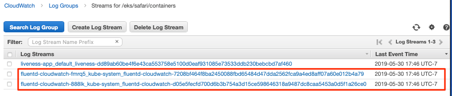

# Monitoring the Application

**Expected Outcome:**

- 200 level understanding of Container Healthchecks using ECS &
    Fargate.

- 200 level understanding of Container Healthchecks using EKS.

- 200 level understanding of shipping container logs for to
    CloudWatch.

**Lab Requirements:**

- The Clou9 IDE.

- One of the following:

  - an Amazon Elastic Container Service Cluster.

  - an Amazon Elastic Container Service for Kubernetes Cluster.

**Average Lab Time:** 45-60 minutes

## Introduction

When it comes to monitoring an application, it is crucial to ensure the application is working rather than only looking to see if a server or container is running. In this module, we will go over some key concepts in monitoring and logging and how to integrate those concepts to our Pet Store application. The module will focus on the following five areas:When it comes to monitoring an application, a key concept to understand is you need to ensure that the application is working rather than only looking to see if a server or container is running. In this module, we will go over some key concepts in monitoring and logging and how to integrate those concepts to our Pet Store application. The module will focus on the following five areas:

1. ECS & Fargate Healthchecks.

2. Kubernetes Healthchecks.

3. Monitoring Healthchecks using [Amazon CloudWatch](https://aws.amazon.com/cloudwatch/).

## Healthchecks in Amazon ECS & Fargate

> **Note**
>
> The following part of the module assumes a working ECS cluster,
> created in the **Amazon ECS & Fargate** module.

Amazon Elastic Container Service (ECS) now supports Docker container
health checks. This gives you more control over monitoring the health of
your tasks and improves the ability of the ECS service scheduler to
ensure your services are healthy.

Previously, the ECS service scheduler relied on the Elastic Load
Balancer (ELB) to report container health status and to restart
unhealthy containers. This required you to configure your ECS Service to
use a load balancer, and only supported HTTP and TCP health-checks.

Now, in addition to supporting ELB health checks, Amazon ECS integrates
with Docker container health checks to allow you to explicitly define
and monitor the health of each container. Using the `HEALTHCHECK`
command, you can define which parameters to monitor for each container
in your Task Definition. Running tasks (groups of running containers)
are now assigned a health status based on the health of their essential
containers, and the task’s health status is integrated with the ECS
service scheduler to automatically redeploy unhealthy tasks and conduct
rolling-updates of services.

> **Tip**
>
> The Amazon ECS container agent only monitors and reports on the health
> checks specified in the task definition. Amazon ECS does not monitor
> Docker health checks that are embedded in a container image and not
> specified in the container definition. Health check parameters that
> are specified in a container definition override any Docker health
> checks that exist in the container image.

### Step 1

Change to this modules directory by running:

    cd ~/environment/aws-modernization-workshop/modules/monitor-application/

### Step 2

To get started, navigate to the
`aws-modernization-workshop/modules/monitor-application/task-definition`
folder where you will see the `petstore-fargate-task-definition.json`
file. Open the `petstore-fargate-task-definition.json` in the Cloud9
IDE.

### Step 3

You will notice that this task definition file is a little different from
the one you already loaded in that we now have added healthcheck values
to the `postgres` and `petstore` sections of `containerDefinitions`, so
that it looks like the example below.

    {
      "family": "<UserName>",
      "networkMode": "awsvpc",
      "containerDefinitions": [{
          "name": "postgres",
          "image": "<YourAccountID>.dkr.ecr.us-west-2.amazonaws.com/<UserName>-petstore_postgres:latest",
          "cpu": 512,
          "memoryReservation": 1024,

    ...

          "logConfiguration": {
            "logDriver": "awslogs",
            "options": {
              "awslogs-group": "<UserName>-petstore-LogGroup",
              "awslogs-region": "us-west-2",
              "awslogs-stream-prefix": "petstore/postgres"
            }
          },
          "healthCheck": {
            "command": ["CMD-SHELL", "pg_isready -U postgres"],
            "interval": 30,
            "timeout": 5,
            "retries": 2,
            "startPeriod": 300

          }
        },
        {
          "name": "petstore",
          "image": "<YourAccountID>.dkr.ecr.us-west-2.amazonaws.com/<UserName>-petstore_frontend:latest",
          "cpu": 512,
          "memoryReservation": 1024,

    ...

          "logConfiguration": {
            "logDriver": "awslogs",
            "options": {
              "awslogs-group": "<UserName>-petstore-LogGroup",
              "awslogs-region": "us-west-2",
              "awslogs-stream-prefix": "petstore/frontend"
            }
          },
          "healthCheck": {
            "command": ["CMD", "curl", "-f", "http://127.0.0.1:8080/"],
            "interval": 30,
            "timeout": 5,
            "retries": 2,
            "startPeriod": 300
          }

    ...

We need to replace the placeholder for your account id in the template
file, so that is aware of your account. The following commands will do
that for you automatically using the `sed` and `aws` cli tools. These
should be executed in the Cloud9 `terminal`.

    ACCOUNT_ID=$(aws ecr describe-repositories --repository-name ${USER_NAME}-petstore_frontend --query=repositories[0].repositoryUri --output=text | cut -d"." -f1) && echo ${ACCOUNT_ID}

    sed -i "s/<YourAccountID>/${ACCOUNT_ID}/" ~/environment/aws-modernization-workshop/modules/monitor-application/task-definition/petstore-fargate-task-definition.json

    sed -i "s/<UserName>/${USER_NAME}/" ~/environment/aws-modernization-workshop/modules/monitor-application/task-definition/petstore-fargate-task-definition.json

### Step 4

Update the petstore task definition from the JSON file by running this
command in your Cloud9 terminal:

    aws ecs register-task-definition --cli-input-json file://~/environment/aws-modernization-workshop/modules/monitor-application/task-definition/petstore-fargate-task-definition.json

### Step 5

Update the `petstore` service in the
`<User Name>-petstore-workshop` cluster with
the latest version of the `petstore` task definition by running the
below command. This will also pull the latest version of the
`petstore_frontend` container we uploaded previously.

    aws ecs update-service --cluster ${USER_NAME}-petstore-workshop --service ${USER_NAME} --task-definition ${USER_NAME} --region us-west-2

Replacing the older version of your task will take a couple of minutes.
To view the status, navigate back to the
`<User Name>-petstore-workshop` cluster created
in a previous module and view the &lt;User Name&gt; service to view your
tasks. You should see the new task being scheduled but you will have to
wait for your task to transition to **RUNNING**.

### Step 6

Once the **petstore** service is **RUNNING**, click on task. You will
notice this version of the task should have a **Health Status** of
**HEALTHY**. This is due to the new healthchecks we added to our task
definition earlier. An example is shown below:

### Step 7

Take some time to inspect the logs for the petstore container in the new
task. You should see the healthchecks every `30` seconds like below:

### Healthchecks in Amazon EKS

> **Note**
>
> The following section of the module assumes a working EKS cluster,
> created in the **Amazon EKS** module.

By default, Kubernetes will restart a container if it crashes for any reason. It uses Liveness and Readiness probes which can be configured for running a robust application by identifying the healthy containers.
It will to send traffic to the healthy ones and will restart the unhealthy in an attempt to restore them to a healthy state.

In this section, we will understand how [liveness and readiness
probes](https://kubernetes.io/docs/tasks/configure-pod-container/configure-liveness-readiness-probes/)
are defined and test the same against different states of a pod. Below
is the high-level description of how these probes work.

- **Liveness probes** are used in Kubernetes to know when a pod is
    alive or dead. A pod can be in a dead state for different reasons
    while Kubernetes kills and recreates the pod when liveness probe
    does not pass.

- **Readiness probes** are used in Kubernetes to know when a pod is
    ready to serve traffic. Only when the readiness probe passes, a pod
    will receive traffic from the service. When readiness probe fails,
    traffic will not be sent to a pod until it passes.

We will review some examples in this module to understand different
options for configuring liveness and readiness probes.

### Configuring the Liveness Probe

As with any Amazon EKS or Kubernetes cluster, we will use manifest file
to declaratively deploy a simple liveness probe.

#### Step 1

In the Cloud9 IDE ‘terminal\`, ensure you have switched to this modules’
working directory.

    cd ~/environment/aws-modernization-workshop/modules/monitor-application/eks/

#### Step 2

In the left-hand navigation pane of the Cloud9 IDE, navigate to the same
folder as above and open the `liveness-app.yaml` file by double clicking
the file.

The file has the following contents:

    apiVersion: v1
    kind: Pod
    metadata:
      name: liveness-app
    spec:
      containers:
      - name: liveness
        image: brentley/ecsdemo-nodejs
        livenessProbe:
          httpGet:
            path: /health
            port: 3000
          initialDelaySeconds: 5
          periodSeconds: 5

#### Step 3

Close the file and apply the manifest by running this command in your
Cloud9 IDE `terminal`:

    kubectl apply -f liveness-app.yaml

Expected Output:

    pod/liveness-app created

#### Step 4

Confirm that the pod is running by executing the following command:

    kubectl get pod liveness-app

Expected Output:

    NAME           READY   STATUS    RESTARTS   AGE
    liveness-app   1/1     Running   0          6s

> **Note**
>
> The number of `RESTARTS` is `0`.

#### Step 5

Use `kubectl describe` command will show an event history which will
show any probe failures or restarts, as follows:

    kubectl describe pod liveness-app | grep -A20 Events

Example Output:

\+

      Type    Reason     Age   From                                                  Message
      ----    ------     ----  ----                                                  -------
      Normal  Scheduled  22s   default-scheduler                                     Successfully assigned default/liveness-app to ip-192-168-84-75.us-west-2.compute.internal
      Normal  Pulling    22s   kubelet, ip-192-168-84-75.us-west-2.compute.internal  pulling image "brentley/ecsdemo-nodejs"
      Normal  Pulled     21s   kubelet, ip-192-168-84-75.us-west-2.compute.internal  Successfully pulled image "brentley/ecsdemo-nodejs"
      Normal  Created    21s   kubelet, ip-192-168-84-75.us-west-2.compute.internal  Created container
      Normal  Started    20s   kubelet, ip-192-168-84-75.us-west-2.compute.internal  Started container

\+ Step 6:: We will now introduce a failure inside the docker runtime by
sending the `kill` command, as follows:

\+

    kubectl exec -it liveness-app -- /bin/kill -s SIGUSR1 1

\+ Step 7:: After 15-20 seconds, re-run the `kubectl describe` command
to view the `Events` output again and see what actions the `kubelet`
took.

\+ Example Output:

\+

      Type     Reason     Age                From                                                  Message
      ----     ------     ----               ----                                                  -------
      Normal   Scheduled  72s                default-scheduler                                     Successfully assigned default/liveness-app to ip-192-168-84-75.us-west-2.compute.internal
      Warning  Unhealthy  36s (x3 over 46s)  kubelet, ip-192-168-84-75.us-west-2.compute.internal  Liveness probe failed: Get http://192.168.85.179:3000/health: net/http: request canceled (Client.Timeout exceeded while awaiting headers)
      Normal   Pulling    6s (x2 over 71s)   kubelet, ip-192-168-84-75.us-west-2.compute.internal  pulling image "brentley/ecsdemo-nodejs"
      Normal   Killing    6s                 kubelet, ip-192-168-84-75.us-west-2.compute.internal  Killing container with id docker://liveness:Container failed liveness probe.. Container will be killed and recreated.
      Normal   Pulled     5s (x2 over 70s)   kubelet, ip-192-168-84-75.us-west-2.compute.internal  Successfully pulled image "brentley/ecsdemo-nodejs"
      Normal   Created    5s (x2 over 70s)   kubelet, ip-192-168-84-75.us-west-2.compute.internal  Created container
      Normal   Started    5s (x2 over 70s)   kubelet, ip-192-168-84-75.us-west-2.compute.internal  Started container

\+ TIP: When the nodejs application entered a debug mode with `SIGUSR1`
signal, it did not respond to the health check pings and the `kubelet`
killed the container. The container was subject to the default restart
policy.

\+ Step 8:: Confirm that the container was restarted by viewing the pod.

\+

    kubectl get pod liveness-app

\+ Expected Output:

\+

    NAME           READY   STATUS    RESTARTS   AGE
    liveness-app   1/1     Running   1          6m42s

\+ NOTE: The number of `RESTARTS` is now `1`.

### Configuring the Readiness Probe

The `readinessProbe` definition explains how a Linux command can be
configured as healthcheck. We create an empty file called
`/tmp/healthy`, to configure readiness probe and use the same to
understand how kubelet helps to update a deployment with only healthy
pods.

#### Step 1

Open the `readiness-deployment.yaml` file by double clicking the
filename in the left-hand navigation of the Cloud9 IDE.

The file has the following contents:

    apiVersion: apps/v1
    kind: Deployment
    metadata:
      name: readiness-deployment
    spec:
      replicas: 3
      selector:
        matchLabels:
          app: readiness-deployment
      template:
        metadata:
          labels:
            app: readiness-deployment
        spec:
          containers:
          - name: readiness-deployment
            image: alpine
            command: ["sh", "-c", "touch /tmp/healthy && sleep 86400"]
            readinessProbe:
              exec:
                command:
                - cat
                - /tmp/healthy
              initialDelaySeconds: 5
              periodSeconds: 3

#### Step 2

We now create a deployment to test the readiness probe. The deployment
consists of 3 replicas of the readiness probe.

    kubectl apply -f readiness-deployment.yaml

#### Step 3

View the deployment by executing the following `kubectl` command:

    kubectl get pods -l app=readiness-deployment

Example Output:

    NAME                                    READY   STATUS    RESTARTS   AGE
    readiness-deployment-6b95b8dd66-dqdzq   0/1     Running   0          8s
    readiness-deployment-6b95b8dd66-tpxll   0/1     Running   0          8s
    readiness-deployment-6b95b8dd66-x2mwn   0/1     Running   0          8s

#### Step 4

Confirm that all replicas are available to serve traffic when a service
is pointed to this deployment.

    kubectl describe deployment readiness-deployment | grep Replicas:

Expected Output:

    Replicas:               3 desired | 3 updated | 3 total | 3 available | 0 unavailable

#### Step 5

We will now introduce a failure inside the docker runtime by deleting
the `/tmp/healthy` file inside the docker runtime, since this file must
be present in order for the readiness check to pass. Pick one of the 3
available pods from the output of **Step 4** to introduce a failure.
Execute the following command, substituting the name of the pod you’ve
selected:

    kubectl exec -it <YOUR-READINESS-POD-NAME> -- rm /tmp/healthy

#### Step 6

View the deployment once again by running the following command:

    kubectl get pods -l app=readiness-deployment

Example Output:

    NAME                                    READY   STATUS    RESTARTS   AGE
    readiness-deployment-6b95b8dd66-74msx   0/1     Running   0          53s
    readiness-deployment-6b95b8dd66-k99vl   1/1     Running   0          53s
    readiness-deployment-6b95b8dd66-pwcgc   1/1     Running   0          53s

> **Note**
>
> Traffic will not be routed to the first pod in the above deployment.
> The `READY` column confirms that the readiness probe for this pod did
> not pass and hence was marked as not ready.

#### Step 7

We will now check for the replicas that are available to serve traffic
when a service is pointed to this deployment.

     kubectl describe deployment readiness-deployment | grep Replicas:

Expected Output:

    Replicas:               3 desired | 3 updated | 3 total | 2 available | 1 unavailable

When the readiness probe for a pod fails, the endpoints controller
removes the pod from list of endpoints of all services that match the
pod.

> **Tip**
>
> Our Liveness Probe example used `HTTP` request and Readiness Probe
> executed a command to check health of a pod. Same can be accomplished
> using a `TCP` request as described in the
> [documentation](https://kubernetes.io/docs/tasks/configure-pod-container/configure-liveness-readiness-probes/).

## Understanding Shipping Logs to CloudWatch from Amazon ECS and EKS

### Amazon ECS

As you are inspecting the properties of your task, each container in the
task should have a link under **Log Configuration** that says
`Log driver: awslogs View logs in CloudWatch`. To navigate to this link,
open the [Amazon ECS](https://us-west-2.console.aws.amazon.com/ecs/)
service console and click **Clusters**.

#### Step 1

Select the `<User Name>-petstore-workshop`
cluster and click on the **Tasks** tab. Select the **Running** task.

#### Step 2

Scroll down to the **Containers** section and expand on the container
for which you wish to see the CloudWatch logs. Click on the
`Log driver: awslogs View logs in CloudWatch` to open the CloudWatch
logs for the specific container.

Once the CloudWatch service console is open, we can view the specific
logs pertaining to our task.

The reason we have the ability to view our containers logs in CloudWatch
is due to the following reasons:

- Our Pet Store application is configured to log to `STDOUT` and
    `STDERR` which is the command output that you would normally see in
    an interactive terminal if you ran the container locally.

- We defined the `logDriver` in our
    `petstore-fargate-task-definition.json` as `awslogs` along with some
    settings around CloudWatch. The awslogs log driver simply passes
    these `STDOUT` and `STDERR` from Docker to CloudWatch.

        ...

              "logConfiguration": {
                "logDriver": "awslogs",
                "options": {
                  "awslogs-group": "<UserName>-petstore-LogGroup",
                  "awslogs-region": "us-west-2",
                  "awslogs-stream-prefix": "petstore/postgres"
                }
              },

        ...

- In order to have our container instances send log data to CloudWatch
    Logs, there is an IAM policy called
    `<User Name>-petstore-ExecutionRole` that
    allows your container instances to use the CloudWatch Logs APIs that
    we are defining in the `petstore-fargate-task-definition.json`.

        ...

          "executionRoleArn": "arn:aws:iam::<YourAccountID>:role/<UserName>-petstore-ExecutionRole",
          "requiresCompatibilities": [
            "FARGATE"
          ],

        ...

### Amazon EKS

> **Note**
>
> The following section of the module assumes a working EKS cluster,
> created in the **Amazon EKS** module.

A typical logging pattern in Kubernetes and hence EKS is to leverage a
pattern known as the **EFK stack**, which is comprised of:

- [Fluentd](https://www.fluentd.org/)

- [Elasticsearch](https://www.elastic.co/products/elasticsearch)

- [Kibana](https://www.elastic.co/products/kibana)

However, in this part of the module, we will only focus on **Fluentd**
as it will be the mechanism that forwards the logs from the individual
worker nodes in the cluster to the central logging backend, CkoudWatch.
We will be deploying Fluentd as a DaemonSet, or one pod per worker node.
The fluentd log daemon will collect logs and forward to CloudWatch Logs.
This will require the nodes to have permissions to send logs and create
log groups and log streams.

#### Step 1

For this part of the module we will need to ensure that the `Role Name`
that the EKS worker nodes use has the necessary policy. Execute the
following commands in the CLoud9 IDE `terminal` to configure the worker
roles variables:

    INSTANCE_PROFILE_NAME=$(aws iam list-instance-profiles | jq -r '.InstanceProfiles[].InstanceProfileName' | grep ${USER_NAME}-petstore-nodegroup)

    INSTANCE_PROFILE_ARN=$(aws iam get-instance-profile --instance-profile-name $INSTANCE_PROFILE_NAME | jq -r '.InstanceProfile.Arn')

    ROLE_NAME=$(aws iam get-instance-profile --instance-profile-name $INSTANCE_PROFILE_NAME | jq -r '.InstanceProfile.Roles[] | .RoleName')

    echo "export ROLE_NAME=${ROLE_NAME}" >> ~/.bashrc

    echo "export INSTANCE_PROFILE_ARN=${INSTANCE_PROFILE_ARN}" >> ~/.bashrc

#### Step 2

Next we configure a policy for CloudWatch access and apply it to the
worker nodes.

    cat <<EoF > /tmp/eks-logs-policy.json
    {
        "Version": "2012-10-17",
        "Statement": [
            {
                "Action": [
                    "logs:DescribeLogGroups",
                    "logs:DescribeLogStreams",
                    "logs:CreateLogGroup",
                    "logs:CreateLogStream",
                    "logs:PutLogEvents"
                ],
                "Resource": "*",
                "Effect": "Allow"
            }
        ]
    }
    EoF

    aws iam put-role-policy --role-name $ROLE_NAME --policy-name ${USER_NAME}_WorkerLogPolicy --policy-document file:///tmp/eks-logs-policy.json

#### Step 3

Validate that the policy has been attached to the worker node role.

    aws iam get-role-policy --role-name $ROLE_NAME --policy-name ${USER_NAME}_WorkerLogPolicy

Expected Output:

    {
        "RoleName": "eksctl-safari-petstore-nodegroup-NodeInstanceRole-1JP1TALI46FK7",
        "PolicyDocument": {
            "Version": "2012-10-17",
            "Statement": [
                {
                    "Action": [
                        "logs:DescribeLogGroups",
                        "logs:DescribeLogStreams",
                        "logs:CreateLogGroup",
                        "logs:CreateLogStream",
                        "logs:PutLogEvents"
                    ],
                    "Resource": "*",
                    "Effect": "Allow"
                }
            ]
        },
        "PolicyName": "safari_WorkerLogPolicy"
    }

#### Step 4

Now we can deploy Fluentd. To get started, navigate to the folder for
this module and open the `fluentd.yaml` in the Cloud9 IDE. Although it
is a large manifest for deploying Fluentd as a **DaemonSet**, i.e. one
pod per worker node, the log agent configuration is located in the
Kubernetes **ConfigMap** as shown below:

    apiVersion: v1
    kind: ServiceAccount
    metadata:
      name: fluentd
      namespace: kube-system
    ---
    apiVersion: rbac.authorization.k8s.io/v1beta1
    kind: ClusterRole
    metadata:
      name: fluentd
      namespace: kube-system
    rules:
    - apiGroups: [""]
      resources:
      - namespaces
      - pods
      verbs: ["get", "list", "watch"]
    ---
    apiVersion: rbac.authorization.k8s.io/v1beta1
    kind: ClusterRoleBinding
    metadata:
      name: fluentd
      namespace: kube-system
    roleRef:
      apiGroup: rbac.authorization.k8s.io
      kind: ClusterRole
      name: fluentd
    subjects:
    - kind: ServiceAccount
      name: fluentd
      namespace: kube-system
    ---
    apiVersion: v1
    kind: ConfigMap
    metadata:
      name: fluentd-config
      namespace: kube-system
      labels:
        k8s-app: fluentd-cloudwatch
    data:
      fluent.conf: |
        @include containers.conf
        @include systemd.conf

        <match fluent.**>
          @type null
        </match>
      containers.conf: |
        <source>
          @type tail
          @id in_tail_container_logs
          @label @containers
          path /var/log/containers/*.log
          pos_file /var/log/fluentd-containers.log.pos
          tag *
          read_from_head true
          <parse>
            @type json
            time_format %Y-%m-%dT%H:%M:%S.%NZ
          </parse>
        </source>

        <label @containers>
          <filter **>
            @type kubernetes_metadata
            @id filter_kube_metadata
          </filter>

          <filter **>
            @type record_transformer
            @id filter_containers_stream_transformer
            <record>
              stream_name ${tag_parts[3]}
            </record>
          </filter>

          <match **>
            @type cloudwatch_logs
            @id out_cloudwatch_logs_containers
            region "#{ENV.fetch('REGION')}"
            log_group_name "/eks/<UserName>/containers"
            log_stream_name_key stream_name
            remove_log_stream_name_key true
            auto_create_stream true
            <buffer>
              flush_interval 5
              chunk_limit_size 2m
              queued_chunks_limit_size 32
              retry_forever true
            </buffer>
          </match>
        </label>
      systemd.conf: |
        <source>
          @type systemd
          @id in_systemd_kubelet
          @label @systemd
          filters [{ "_SYSTEMD_UNIT": "kubelet.service" }]
          <entry>
            field_map {"MESSAGE": "message", "_HOSTNAME": "hostname", "_SYSTEMD_UNIT": "systemd_unit"}
            field_map_strict true
          </entry>
          path /run/log/journal
          pos_file /var/log/fluentd-journald-kubelet.pos
          read_from_head true
          tag kubelet.service
        </source>

        <source>
          @type systemd
          @id in_systemd_kubeproxy
          @label @systemd
          filters [{ "_SYSTEMD_UNIT": "kubeproxy.service" }]
          <entry>
            field_map {"MESSAGE": "message", "_HOSTNAME": "hostname", "_SYSTEMD_UNIT": "systemd_unit"}
            field_map_strict true
          </entry>
          path /run/log/journal
          pos_file /var/log/fluentd-journald-kubeproxy.pos
          read_from_head true
          tag kubeproxy.service
        </source>

        <source>
          @type systemd
          @id in_systemd_docker
          @label @systemd
          filters [{ "_SYSTEMD_UNIT": "docker.service" }]
          <entry>
            field_map {"MESSAGE": "message", "_HOSTNAME": "hostname", "_SYSTEMD_UNIT": "systemd_unit"}
            field_map_strict true
          </entry>
          path /run/log/journal
          pos_file /var/log/fluentd-journald-docker.pos
          read_from_head true
          tag docker.service
        </source>

        <label @systemd>
          <filter **>
            @type record_transformer
            @id filter_systemd_stream_transformer
            <record>
              stream_name ${tag}-${record["hostname"]}
            </record>
          </filter>

          <match **>
            @type cloudwatch_logs
            @id out_cloudwatch_logs_systemd
            region "#{ENV.fetch('REGION')}"
            log_group_name "/eks/<UserName>/systemd"
            log_stream_name_key stream_name
            auto_create_stream true
            remove_log_stream_name_key true
            <buffer>
              flush_interval 5
              chunk_limit_size 2m
              queued_chunks_limit_size 32
              retry_forever true
            </buffer>
          </match>
        </label>
    ---
    apiVersion: extensions/v1beta1
    kind: DaemonSet
    metadata:
      name: fluentd-cloudwatch
      namespace: kube-system
      labels:
        k8s-app: fluentd-cloudwatch
    spec:
      template:
        metadata:
          labels:
            k8s-app: fluentd-cloudwatch
        spec:
          serviceAccountName: fluentd
          terminationGracePeriodSeconds: 30
          # Because the image's entrypoint requires to write on /fluentd/etc but we mount configmap there which is read-only,
          # this initContainers workaround or other is needed.
          # See https://github.com/fluent/fluentd-kubernetes-daemonset/issues/90
          initContainers:
          - name: copy-fluentd-config
            image: busybox
            command: ['sh', '-c', 'cp /config-volume/..data/* /fluentd/etc']
            volumeMounts:
            - name: config-volume
              mountPath: /config-volume
            - name: fluentdconf
              mountPath: /fluentd/etc
          containers:
          - name: fluentd-cloudwatch
            image: fluent/fluentd-kubernetes-daemonset:v1.1-debian-cloudwatch
            env:
              - name: REGION
                value: us-west-2
              - name: CLUSTER_NAME
                value: petstore
            resources:
              limits:
                memory: 200Mi
              requests:
                cpu: 100m
                memory: 200Mi
            volumeMounts:
            - name: config-volume
              mountPath: /config-volume
            - name: fluentdconf
              mountPath: /fluentd/etc
            - name: varlog
              mountPath: /var/log
            - name: varlibdockercontainers
              mountPath: /var/lib/docker/containers
              readOnly: true
            - name: runlogjournal
              mountPath: /run/log/journal
              readOnly: true
          volumes:
          - name: config-volume
            configMap:
              name: fluentd-config
          - name: fluentdconf
            emptyDir: {}
          - name: varlog
            hostPath:
              path: /var/log
          - name: varlibdockercontainers
            hostPath:
              path: /var/lib/docker/containers
          - name: runlogjournal
            hostPath:
              path: /run/log/journal

#### Step 5

First we have to update the `log_group_name` so it’s uniquely
identifiable. The following command will substitute the
**&lt;UserName&gt;** parameter in the manifest with your unique
username.

    sed -i "s/<UserName>/${USER_NAME}/" ~/environment/aws-modernization-workshop/modules/monitor-application/eks/fluentd.yml

#### Step 6

Apply the manifest to create the fluentd DaemonSet.

> **Note**
>
> Ensure that you are working in this module’s directory. i.e.
> `~/environment/aws-modernization-workshop/modules/monitor-application/eks`

    kubectl apply -f fluentd.yml

#### Step 7

We can confirm that all the pods change to `Running` status by executing
the following command:

    kubectl get pods -w --namespace=kube-system

Expected Output:

    NAME                       READY   STATUS    RESTARTS   AGE
    aws-node-k75kc             1/1     Running   0          4h
    aws-node-w9d7n             1/1     Running   0          4h
    coredns-6fdd4f6856-mvlst   1/1     Running   0          4h6m
    coredns-6fdd4f6856-xzc9x   1/1     Running   0          4h6m
    fluentd-cloudwatch-55p6x   1/1     Running   0          21s
    fluentd-cloudwatch-sn25n   1/1     Running   0          21s
    kube-proxy-hgmvw           1/1     Running   0          4h
    kube-proxy-r84rb           1/1     Running   0          4h

#### Step 8

Now we can view the CloudWatch log streams for the containers in our
`kube-system`. To do this, open a browser tab and navigate to the
[CloudWatch
Console](https://us-west-2.console.aws.amazon.com/cloudwatch/) and click
**Logs** in the navigation pane. All the CloudWatch Log Groups will be
displayed.

#### Step 9

In the **Filter:** box, enter `eks` and press `[ENTER]` to filter the
Log Group for our EKS cluster. Click on the
`/eks/<User Name>/containers` Log Group.

Now we can see all the logs for the various containers in our
`kube-system`.

This concludes the **Application Monitoring** module. Please continue to
the next module.
